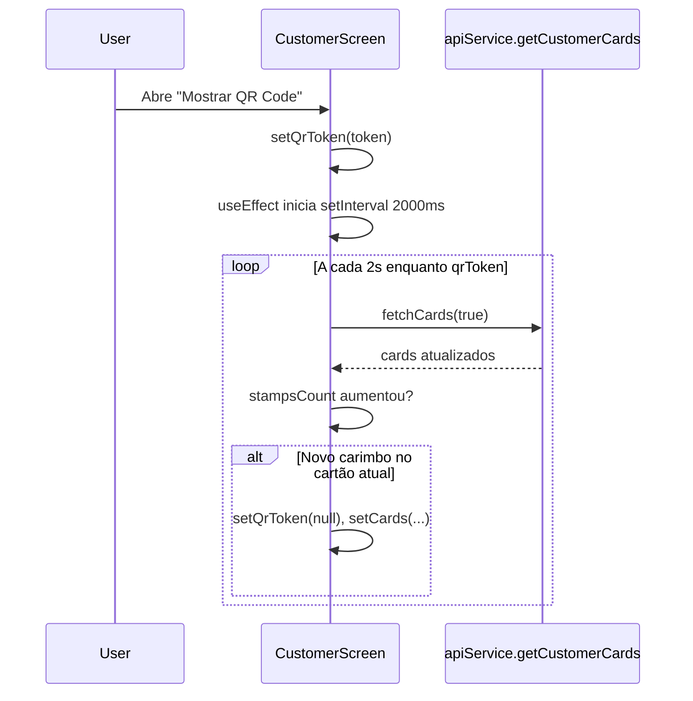

# Análise: fechar modal de QR e mostrar carimbo novo

## Como está implementado

O fluxo está concentrado em [`CustomerScreen.tsx`](C:\empreender\carimbai-app\src\components\CustomerScreen.tsx) (componente exportado como `HomeScreen`). O [`QRCodeModal.tsx`](C:\empreender\carimbai-app\src\components\QRCodeModal.tsx) só exibe o QR e chama `onClose`; **não** participa da detecção do carimbo.

1. **Carregamento inicial**: `fetchCards()` (sem polling) popula `cards` e, na primeira resposta com cartões, define `previousStampsCountRef` com **`updatedCards[0].stampsCount`** (sempre o **primeiro** cartão da lista, não o selecionado).

2. **Com o modal de carimbo aberto** (`qrToken` não nulo): um `useEffect` registra `setInterval(..., 2000)` que chama `fetchCards(true)`.

3. **Durante o polling** (`isPolling === true` e existe `card` atual):
   - Busca o cartão atualizado pelo mesmo `cardId`.
   - **Fecha o modal de carimbo** se: `qrToken` **e** `previousStampsCountRef.current > 0` **e** `updatedCurrent.stampsCount > previousStampsCountRef.current`, então `setQrToken(null)`.
   - **Fecha o modal de resgate** se: `redeemQrToken` **e** `status === 'ACTIVE'` **e** `stampsCount === 0`, então `setRedeemQrToken(null)`.
   - Atualiza `previousStampsCountRef` com o novo `stampsCount`.

4. **“Refresh” da UI**: ao chamar `setCards(updatedCards)`, o React re-renderiza a grade de carimbos com os dados novos; não há `location.reload()`.

5. **Segundo `useEffect`**: espelha a mesma lógica quando `redeemQrToken` está ativo (polling de 2s).

---

## Pontos fracos / riscos da abordagem atual

| Aspecto | Observação |
|--------|------------|
| **Custo de rede** | Enquanto o modal está aberto, há requisição a cada 2s, mesmo em segundo plano (aba pode estar oculta). |
| **Latência** | Pior caso ~2s após o lojista aplicar o carimbo (média ~1s). |
| **Primeiro carimbo (0 → 1)** | A condição `previousStampsCountRef.current > 0` **impede** fechar o modal quando o cliente tinha **0** carimbos e recebe o primeiro — provável **bug**. |
| **Vários cartões** | O ref na carga inicial usa só `cards[0]`; se o usuário trocar de aba ou o primeiro cartão não for o selecionado, o baseline pode ficar **inconsistente** com o cartão em que o QR foi gerado. |
| **Resgate** | A heurística `ACTIVE && stampsCount === 0` pode ser frágil se no futuro o modelo de dados mudar. |

---

## Caminhos melhores (por esforço)

1. **Correções locais (baixo esforço, recomendado antes de infra nova)**  
   - Ao abrir o QR (`handleShowQR` / `handleShowRedeemQR`), gravar baseline explícito: `previousStampsCountRef = card.stampsCount` e `previousCardStatusRef = card.status` para **o `card` atual**.  
   - Fechar modal de carimbo quando `updatedCurrent.stampsCount > baseline` **sem** exigir `baseline > 0` (corrige 0 → 1).  
   - Na carga inicial de `fetchCards` sem polling, inicializar o ref a partir de `updatedCards[selectedIndex]` (ou do cartão selecionado por id), não só `[0]`.  
   - Opcional: [`document.visibilityState`](https://developer.mozilla.org/en-US/docs/Web/API/Document/visibilitychange) — pausar o intervalo quando `document.hidden` for `true` para economizar bateria/dados.

2. **Polling mais eficiente no backend (médio esforço)**  
   - Endpoint tipo “long poll” ou ETag/`If-None-Match` em `getCustomerCards` para reduzir payload quando nada mudou (exige mudanças no [`CardsController`](C:\Users\lucas\IdeaProjects\carimbai\src\main\java\com\app\carimbai\controllers\CardsController.java) / serviço).

3. **Tempo real (maior esforço)**  
   - WebSocket ou SSE no backend notificando “carimbo aplicado” / “resgate concluído” para o `customerId` ou `cardId`; o cliente escuta e chama **uma** vez `fetchCards` (ou atualização incremental). Elimina polling e reduz latência, mas exige autenticação de canal, reconexão e possivelmente infra (Redis, etc.).

4. **Push (já existe hook)**  
   - [`usePushNotifications`](C:\empreender\carimbai-app\src\hooks\usePushNotifications.ts) pode complementar quando o app **não** está em primeiro plano; não substitui atualização imediata da UI com o modal aberto sem ainda receber o evento no cliente (a menos que a notificação dispare refresh).

---

## Recomendação prática

- **Curto prazo**: tratar como **bug** o fechamento na transição **0 → 1** carimbos e alinhar baseline ao **cartão selecionado** ao gerar o QR; manter polling de 2s como solução simples.  
- **Médio prazo**: pausar polling com **Page Visibility** e avaliar ETag/long poll se o tráfego ou escala crescer.  
- **Longo prazo**: SSE/WebSocket se a experiência precisar ser instantânea e o custo de infra for aceitável.
